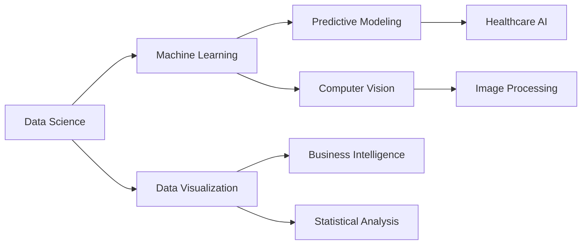

#  Hey there, I'm Swayam Prakash Panda!

<div align="center">
  
</div>

<div align="center">
  
  
</div>

## 🚀 About Me

```python
class SwayamPanda:
    def __init__(self):
        self.name = "Swayam Prakash Panda"
        self.education = "B.Tech CSE (AIML) @ VIT Bhopal"
        self.role = "Data Analyst & AI/ML Enthusiast"
        self.location = "Daman and Diu, India"
        self.interests = ["Machine Learning", "Data Analysis", "Computer Vision", "Cryptography"]
        self.motto = "Solving real-world problems through data and AI"
    
    def current_focus(self):
        return [
            "🔍 Advanced Machine Learning & Predictive Modeling",
            "📊 Data Visualization & Analytics",
            "🤖 AI-driven Solutions for Healthcare",
            "🌐 Open Source Contributions"
        ]
    
    def say_hi(self):
        print("Thanks for dropping by! Let's build something amazing together 🚀")

me = SwayamPanda()
me.say_hi()
```

<div align="center">
  
</div>

## 🛠️ Tech Arsenal

<div align="center">

### 💻 Programming Languages


### 📊 Data Science & ML


### 🛠️ Tools & Platforms


</div>

## 🏆 Featured Projects

<div align="center">
  <table>
    <tr>
      <td width="50%">
        <h3 align="center">🐠 Goldfish Password Generator</h3>
        <div align="center">
          <a href="https://github.com/swayam200/goldfish_password_generator" target="_blank">
            
          </a>
          <p><strong>Computer Vision & Cryptography</strong> - Revolutionary TRNG using goldfish movements as entropy source with SHA-256 hashing</p>
        </div>
      </td>
      <td width="50%">
        <h3 align="center">🦠 Leptospirosis Predictor</h3>
        <div align="center">
          <a href="https://github.com/swayam200/Leptospirosis-Predictor" target="_blank">
            
          </a>
          <p><strong>Healthcare AI</strong> - ML model enhancing diagnostic capabilities using medical and weather data</p>
        </div>
      </td>
    </tr>
    <tr>
      <td width="50%">
        <h3 align="center">🚂 Indian Railways Analysis</h3>
        <div align="center">
          <a href="https://github.com/swayam200/Indian-Railways-Analysis" target="_blank">
            
          </a>
          <p><strong>Data Analytics Capstone</strong> - End-to-end analysis identifying ticket confirmation factors</p>
        </div>
      </td>
      <td width="50%">
        <h3 align="center">🎮 Shape Recognition AI Game</h3>
        <div align="center">
          <a href="https://github.com/swayam200/Shape_Recog_Game" target="_blank">
            
          </a>
          <p><strong>Interactive ML</strong> - AI-powered drawing game with real-time shape prediction</p>
        </div>
      </td>
    </tr>
  </table>
</div>

## 📈 GitHub Analytics

<div align="center">
  
  
</div>

<div align="center">
  
</div>

## 🏅 Achievements & Certifications

<div align="center">

| 🎯 **Certifications** | 🏆 **Achievements** |
|:---|:---|
| 📊 Google Data Analytics Professional Certificate | 🚀 Startup Star Season 1 - 7th Place Finalist |
| 🔬 BCG Data Science Job Simulation (Forage) | 🌟 Open Source Contributor - AcWoC 2025 |
| 🐍 University of Michigan: Applied ML in Python | 📚 Programming for Everybody (Python) |
| 💻 HackerRank: Python & SQL Certified | 🎯 Pull Shark Achievement |

</div>

## 📊 Current Focus Areas



## 🤝 Let's Connect & Collaborate!

<div align="center">
  
[](https://linkedin.com/in/swayam200)
[](https://github.com/swayam200)
[](https://swayam200.github.io)
[](mailto:swayam.panda200@gmail.com)

</div>

---

<div align="center">
  
  
  <h3>💫 "Data tells stories, AI makes them actionable, and I bring both to life!" 💫</h3>
  
  
</div>

---

<div align="center">
  <sub>⭐ From <a href="https://github.com/swayam200">Swayam200</a> with ❤️</sub>
</div>
