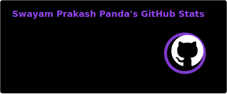
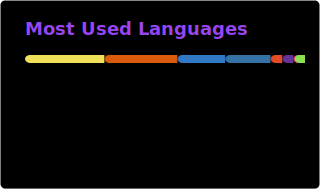

<div align="center">


<br/>

[](https://swayam200.me)
[](https://linkedin.com/in/swayam200)
[](https://github.com/swayam200)
[](mailto:swayam.panda200@gmail.com)
[](https://twitter.com/swayam200)

<br/>


[](https://github.com/swayam200)

</div>

---

## 🧑‍💻 About Me

```python
class Swayam:
    name       = "Swayam Prakash Panda"
    location   = "Daman, India 🇮🇳"
    education  = "B.Tech CSE (AI & ML) @ VIT Bhopal (2023–2027) | CGPA: 8.64"
    role       = "AI Engineer · Backend Developer · IEEE Author"

    research   = "Cross-platform misinformation detection + entropy-based cryptography"
    interests  = ["NLP", "Transfer Learning", "ML Systems", "Scalable Backends", "Computer Vision"]

    currently  = [
        "Summer Intern @ FOSSEE, IIT Bombay",
        "Python Dev Intern @ TechMasterAI Digi Pvt. Ltd.",
        "Student Coordinator @ GeeksforGeeks VIT Bhopal",
        "Technical Team Lead @ VITB AI Innovators Hub",
        "Building Darzi: AI Resume Suite",
    ]

    fun_fact   = "I once generated passwords using goldfish movement entropy 🐠"
```

---

## 🔬 Research & Publications

<table>
<tr>
<td width="60px" align="center">📄</td>
<td>

**True Random Number Generator using Biological Entropy**

*IEEE ASSIC 2026 · KIIT University · Aug 8–10, 2026 · Accepted for publication*

- Explores entropy extraction from biological motion for secure random number generation
- Uses real-world motion capture and cryptographic hashing to create robust random seeds
- Accepted for IEEE Xplore publication and indexed in Scopus & Web of Science

</td>
</tr>
<tr>
<td width="60px" align="center">📄</td>
<td>

**Evaluating the Portability of BERT-based Misinformation Detection from Twitter to Bluesky**

*IEEE RCSM 2025 · MANIT Bhopal · Dec 5–6, 2025 · Published in IEEE Xplore*

- Conducted a 3-stage controlled cross-platform transfer experiment using BERT-based classifiers
- Achieved **F1 = 0.73** in zero-shot transfer (Twitter → Bluesky)
- Improved to **F1 = 0.997** after platform-specific fine-tuning
- Showed that foundational misinformation signals are portable, but optimal performance requires domain adaptation

*Supervisor: Dr. Ajay Kumar Phulre · IEEE Conf. No.: 67767*

</td>
</tr>
</table>

---

## 💼 Experience

<details open>
<summary><b>🏢 Summer Intern — FOSSEE, IIT Bombay &nbsp;|&nbsp; May 2026 – Present</b></summary>
<br/>

- Currently working on Osdag - an open source project for the design and detailing of steel structures. Primarily working with Python and Python based FLOSS tools such as PySide, OpenCascade, PythonOCC, and PyLaTeX.

</details>

<details open>
<summary><b>🏢 Python Development Intern — TechMasterAI Digi Pvt. Ltd. &nbsp;|&nbsp; Jan 2026 – Feb 2026</b></summary>
<br/>

- Built a text moderation API using **FastAPI** with a dual-layer detection pipeline (dictionary + ML fallback) achieving **sub-1ms latency**
- Developed a real-time, CPU-native Speech-to-Text microservice using **Vosk** and **WebSockets**, maintaining **<50ms** chunking latency
- Orchestrated a cloud migration (**AWS**, **Vercel**) and implemented **Docker**-based CI/CD, reducing infrastructure costs by **45%** and deployment time by **70%**

</details>

<details open>
<summary><b>🎓 Winter Intern (NPTEL) — IIT Ropar &nbsp;|&nbsp; Dec 2025 – Jan 2026</b></summary>
<br/>

- Studied **Ajrasakha** (GenAI agri-tech), focusing on multi-stage query resolution pipelines and curated dataset integration
- Analyzed **ViBe LMS** for AI-proctored video delivery, scalability, and role-based access control design
- Assessed trade-offs in integrating **LLM-based components** into production-scale educational platforms

</details>

<details open>
<summary><b>⚡ Student Coordinator — GeeksforGeeks VIT Bhopal Chapter &nbsp;|&nbsp; Jan 2025 – Present</b></summary>
<br/>

- Led a **50-member technical core team** to organize campus-scale events
- Spearheaded **"Borderlands: Survive the Chaos"** at AdVITya 2026 with **200+ participants**
- Built interactive event platforms **Riddle Booth** and **Algo Rush** for AdVITya '25 using **Node.js, Express, Socket.IO**
- Developed the full event platform and club website with **React, Node.js, and Socket.IO**

</details>

<details open>
<summary><b>🤖 Technical Team Lead — VITB AI Innovators Hub &nbsp;|&nbsp; Sep 2025 – Present</b></summary>
<br/>

- Coordinated a cross-functional team of **75+ members** across research and engineering roles
- Led the **Darzi: AI Resume Suite** initiative — sprint planning, task allocation, and development workflow
- Structured scalable workflows to support experimentation and parallel feature development

</details>

---

## 🛠️ Tech Stack

<div align="center">

**Languages**


**Web & Backend**


**ML, AI & Data**


**DevOps & Cloud**


</div>

---

## ⭐ Featured Projects

<table>
<tr>
<td width="50%">

### 🐠 [Goldfish Password Generator](https://github.com/swayam200/goldfish_password_generator)
> *Python · OpenCV · SHA-256 · Cryptography*

A **True Random Number Generator** harvesting entropy from real-time fish movement via computer vision. Euclidean motion tracking feeds a SHA-256 hashing pipeline, validated with statistical randomness testing.

</td>
<td width="50%">

### 🦠 [Leptospirosis Risk Predictor](https://github.com/swayam200/Leptospirosis-Predictor)
> *Python · scikit-learn · React · Node.js · PostgreSQL*

ML pipeline predicting **disease outbreak risk** from climate and epidemiological datasets across European regions. Full-stack deployment with geospatial visualization dashboards.

</td>
</tr>
<tr>
<td width="50%">

### 🏟️ [KhelSaarthi — Your Sport, Your Community](https://github.com/swayam200/Khel-Saarthi)
> *React Native · Node.js · Express · MongoDB · Socket.IO · JWT*

Mobile-first platform connecting **grassroots athletes with local sports organisers**. Features role-based auth, event discovery, registration, and real-time chat.

</td>
<td width="50%">

### ⚗️ [Carbon Sleuth](https://github.com/swayam200/carbon-sleuth)
> *Django REST · React · PyQt5 · pandas*

Hybrid **Web + Desktop application** for chemical equipment parameter visualisation. Combines a Django REST API backend with a React frontend and a PyQt5 desktop client.

</td>
</tr>
</table>

---

## 📊 GitHub Analytics

<!-- Stats & langs: generated daily by .github/workflows/grs.yml and stored as local SVGs -->
<a href="https://github.com/swayam200"></a>
<a href="https://github.com/swayam200"></a>

<br/>


<br/>


---

## 🐍 Contribution Snake


---

## 🎖️ Achievements & Certifications

| 🏅 Achievement | 📅 Year |
|:---|:---:|
| 📜 **Google Data Analytics Professional Certificate** | 2025 |
| 🐍 **Applied Machine Learning in Python** — University of Michigan | 2024 |
| ☁️ **Cloud Computing** — NPTEL | 2025 |
| 🥇 **IEEE RCSM 2025** — Paper accepted & presented at MANIT Bhopal | 2025 |
| 🚀 **Startup Star Season 1** — 7th Place, Startupvapi *(Pitched Petmania)* | 2022 |

---

## 🌐 Let's Connect

<div align="center">

*Always open to research collaborations, interesting projects, and good engineering conversations.*

<br/>

[](https://swayam200.me)
[](https://linkedin.com/in/swayam200)
[](mailto:swayam.panda200@gmail.com)
[](https://github.com/swayam200)

</div>

<br/>


